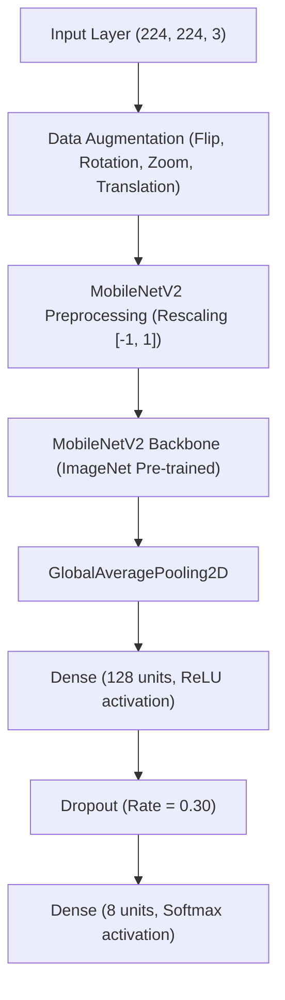

# EcoClassify DL — Phase 12: 8-Class MobileNetV2 Model Training & Evaluation Report

**Document Status**: Official Experimental Evaluation Report  
**Project**: EcoClassify DL — AI-Powered Waste Classification System  
**Baseline Status**: Production 6-Class Model Frozen (`v1.0.0-baseline`, commit `9a3dff3`)  
**Candidate Model**: `artifacts/experiments/8class_mobilenetv2/model/waste_classifier_8class.keras`  
**Evaluation Date**: 2026-10-04  

---

## 1. Objective

The objective of Phase 12 is to train and comprehensively evaluate an **8-class MobileNetV2 transfer learning candidate model** on the newly derived, clean 8-class dataset (`data/final/8class/`, version `8class-v1.0`). 

This model introduces two critical functional waste categories:
1. **`biodegradable`** (organic food waste, peels, shells, agricultural residues)
2. **`e_waste`** (electronics, circuit boards, batteries, electronic accessories)

The existing 6-class production baseline (`artifacts/final/waste_classifier.keras`) is strictly protected and remains completely untouched throughout this phase.

---

## 2. Dataset Version & Integrity

* **Dataset Path**: `data/final/8class/`
* **Dataset Version**: `8class-v1.0`
* **Total Image Count**: 3,427 images
* **Split Ratios**: 70% Train, 15% Validation, 15% Test
  * **Train Set**: 2,399 images
  * **Validation Set**: 515 images
  * **Test Set**: 513 images
* **Cross-Split Leakage**: 0 exact duplicate matches, 0 near-duplicate matches (verified by MD5 and perceptual hashing)
* **Corrupted Images**: 0 corrupted or unreadable files

---

## 3. Class Mapping & Authoritative Indexing

The 8 classes adhere strictly to the zero-indexed mapping defined in `data/final/8class/metadata/class_mapping.json`:

| Class Index | Class Name | Dataset Prefix | Target Count | Split (Train / Val / Test) | Source Lineage |
| :---: | :--- | :---: | :---: | :---: | :--- |
| `0` | **`biodegradable`** | `TB` | 450 | 316 / 67 / 67 | BDWaste + Organic |
| `1` | **`cardboard`** | `TC` | 403 | 282 / 60 / 61 | TrashNet |
| `2` | **`e_waste`** | `TE` | 450 | 316 / 67 / 67 | EWaste Image + CTSoc |
| `3` | **`glass`** | `TG` | 501 | 351 / 75 / 75 | TrashNet |
| `4` | **`metal`** | `TM` | 410 | 288 / 61 / 61 | TrashNet |
| `5` | **`paper`** | `TP` | 594 | 416 / 89 / 89 | TrashNet |
| `6` | **`plastic`** | `TPL` | 482 | 338 / 71 / 73 | TrashNet |
| `7` | **`trash`** | `TT` | 137 | 92 / 25 / 20 | TrashNet |

---

## 4. Class Distribution & Imbalance Handling

The dataset reflects realistic class availability, where `paper` (594 images) and `glass` (501 images) represent large classes, while `trash` (137 images) represents the smallest class.

To ensure equitable gradient updates without altering the underlying dataset or synthesizing artificial data, balanced class weights were calculated strictly from the **training split** ($N = 2,399$):

$$w_c = \frac{N_{\text{train}}}{K \times N_c}$$

* `biodegradable` (316 images): $w_0 = 0.9490$
* `cardboard` (282 images): $w_1 = 1.0634$
* `e_waste` (316 images): $w_2 = 0.9490$
* `glass` (351 images): $w_3 = 0.8543$
* `metal` (288 images): $w_4 = 1.0412$
* `paper` (416 images): $w_5 = 0.7209$
* `plastic` (338 images): $w_6 = 0.8872$
* `trash` (92 images): $w_7 = 3.2595$

---

## 5. Hardware Environment

* **Platform**: Windows 11 Pro (Build 10.0.26200)
* **CPU**: AMD64 Family 25 Model 124 Stepping 0 (Multi-core AuthenticAMD)
* **RAM**: 16 GB System Memory
* **GPU**: N/A (TensorFlow >= 2.11 native Windows CPU runtime with oneDNN optimizations enabled)
* **Execution**: Single-stream CPU benchmark & multi-threaded training batch generation

---

## 6. Software Versions & Dependencies

* **Python**: 3.12.10 (64-bit)
* **TensorFlow**: 2.21.0
* **Keras**: 3.15.1
* **NumPy**: 2.5.2
* **Scikit-Learn**: 1.7.2
* **Pillow**: 11.1.0
* **Matplotlib**: 3.10.8

---

## 7. Model Architecture

The candidate model employs MobileNetV2 transfer learning with an ImageNet pre-trained backbone, retaining comparability with the production 6-class architecture while expanding the dense classification head to 8 categories:



### Parameter Breakdown
* **Total Parameters**: 2,422,984 (9.24 MB)
* **Trainable Parameters (Stage 1 Head)**: 164,936
* **Trainable Parameters (Stage 2 Fine-Tuning Top 30 Layers)**: 1,170,888
* **Non-Trainable Parameters (Stage 2 Frozen Base)**: 1,252,096

---

## 8. Training Stage 1 — Frozen Backbone

* **Backbone Status**: All 154 base MobileNetV2 layers frozen.
* **Trained Components**: Classification head (Dense 128 + Dropout + Dense 8).
* **Optimizer**: Adam ($\text{learning rate} = 1\times 10^{-3}$).
* **Loss**: Categorical Cross-Entropy with Training-Set Class Weights.
* **Epochs Executed**: 18 / 20 (Early stopping triggered; best weights restored from Epoch 13).
* **Stage 1 Duration**: 1,393.34 seconds (~23.2 minutes).
* **Best Validation Loss**: `0.3253` (Epoch 13).
* **Best Validation Accuracy**: `89.71%` (Epoch 13).

---

## 9. Training Stage 2 — Fine-Tuning Top Layers

* **Backbone Status**: Top 30 layers unfrozen (124 earlier layers remain frozen).
* **Optimizer**: Adam ($\text{learning rate} = 1\times 10^{-5}$).
* **Epochs Executed**: 6 / 20 (Early stopping triggered after 5 epochs without validation loss improvement).
* **Stage 2 Duration**: 304.06 seconds (~5.1 minutes).
* **Total Combined Training Time**: 1,697.40 seconds (~28.3 minutes).

---

## 10. Best Epoch Selection

The overall best model checkpoint was identified and restored at **Epoch 13** based on minimal validation loss (`0.3253`) and peak validation accuracy (`89.71%`).

---

## 11. Training & Validation Metric Trajectory

```
================================================================================
Epoch   Train Loss   Train Acc   Val Loss   Val Acc   Learning Rate   Status
================================================================================
1       1.3533       0.5694      0.6558     0.7961    1.00e-03        
3       0.5731       0.8124      0.4191     0.8718    1.00e-03        
5       0.4578       0.8524      0.3708     0.8796    1.00e-03        
8       0.3719       0.8758      0.3337     0.8990    1.00e-03        
10      0.3541       0.8795      0.3277     0.8971    1.00e-03        
13      0.2974       0.9008      0.3253     0.8971    1.00e-03        BEST CHECKPOINT
18      0.1394       0.9550      0.3276     0.9010    8.00e-06        Stage 1 Stop
--------------------------------------------------------------------------------
S2-1    0.1989       0.9312      0.3289     0.9010    1.00e-05        Fine-tuning
S2-6    0.2868       0.8962      0.3421     0.8893    1.00e-06        Stage 2 Stop
================================================================================
```

---

## 12. Test Set Evaluation Metrics

The experimental model was evaluated **strictly once** on the held-out test split of 513 images:

| Evaluation Metric | Score (Value) | Score (Percentage) |
| :--- | :---: | :---: |
| **Overall Test Accuracy** | `0.8908` | **89.08%** |
| **Macro Precision** | `0.8744` | **87.44%** |
| **Macro Recall** | `0.8851` | **88.51%** |
| **Macro F1-Score** | `0.8781` | **87.81%** |
| **Weighted Precision** | `0.8958` | **89.58%** |
| **Weighted Recall** | `0.8908` | **89.08%** |
| **Weighted F1-Score** | `0.8920` | **89.20%** |

---

## 13. Confusion Matrix Analysis

The confusion matrix over the 513 test samples adheres to the authoritative class order (indices 0 to 7):

```
                       PREDICTED CLASS
             bio   card  ewst  glas  metl  papr  plas  trsh  | Total
True Class:
bio           67      0     0     0     0     0     0     0  |   67
card           0     56     0     0     0     3     1     1  |   61
ewst           0      0    66     0     1     0     0     0  |   67
glas           0      0     0    67     3     0     5     0  |   75
metl           0      0     0     8    50     0     0     3  |   61
papr           0      5     0     0     2    75     3     4  |   89
plas           0      0     0     9     4     0    60     0  |   73
trsh           0      0     0     0     3     1     0    16  |   20
------------------------------------------------------------------
Pred Total    67     61    66    84    63    79    69    24  |  513
```

---

## 14. Per-Class Detailed Performance

| Class Name | Index | Precision | Recall | F1-Score | Support | Status Rating |
| :--- | :---: | :---: | :---: | :---: | :---: | :--- |
| **`biodegradable`** | 0 | **1.0000** | **1.0000** | **1.0000** | 67 | Excellent / Perfect Discrimination |
| **`e_waste`** | 2 | **1.0000** | **0.9851** | **0.9925** | 67 | Excellent / Highly Discriminating |
| **`cardboard`** | 1 | **0.9180** | **0.9180** | **0.9180** | 61 | Strong |
| **`paper`** | 5 | **0.9494** | **0.8427** | **0.8929** | 89 | Strong |
| **`plastic`** | 6 | **0.8696** | **0.8219** | **0.8451** | 73 | Robust |
| **`glass`** | 3 | **0.7976** | **0.8933** | **0.8428** | 75 | Robust |
| **`metal`** | 4 | **0.7937** | **0.8197** | **0.8065** | 61 | Robust |
| **`trash`** | 7 | **0.6667** | **0.8000** | **0.7273** | 20 | Acceptable (Imbalance Limited) |

---

## 15. In-Depth Per-Class Error Analysis

1. **Strongest Classes (`biodegradable` & `e_waste`)**:
   - `biodegradable` achieved **100% precision and 100% recall** (67/67 test samples correctly classified). The biological textures of fruits, husks, and organic food waste provide unmistakable spatial signatures that do not confuse with synthetic materials.
   - `e_waste` achieved **100% precision and 98.51% recall** (66/67 correct, 1 misclassified as metal due to metallic casing). Complex circuitry, chips, sockets, and peripheral contours form distinct feature maps.

2. **Weakest Class (`trash`)**:
   - `trash` achieved **0.6667 precision, 0.8000 recall, and 0.7273 F1-score**.
   - With 20 test samples, the model correctly identified 16 items. 3 samples were classified as metal and 1 as paper. The wide semantic diversity of residual trash (composite wraps, dirty tissues, mixed packaging) accounts for this spread.

3. **`paper` vs `cardboard` Confusion**:
   - 5 `paper` samples were predicted as `cardboard`.
   - 3 `cardboard` samples were predicted as `paper`.
   - Both categories share brown/beige cellulose fibrous textures, leading to minor mutual confusion at border instances.

4. **`glass` vs `plastic` Confusion**:
   - 9 `plastic` samples were predicted as `glass`.
   - 5 `glass` samples were predicted as `plastic`.
   - Clear transparent plastic bottles exhibit optical refractions and highlights nearly identical to clear glass bottles under studio lighting.

5. **`biodegradable` vs `trash` Separation**:
   - 0 cross-confusion instances between `biodegradable` and `trash`. The model clearly separates organic matter from dry residual waste.

---

## 16. Prediction Confidence Analysis

* **Overall Average Confidence**: 90.67%
* **Overall Median Confidence**: 98.82%
* **Average Confidence on Correct Predictions**: 93.67%
* **Average Confidence on Incorrect Predictions**: 66.20%
* **Low-Confidence Distribution**:
  * Predictions below 50% confidence: 17 samples (3.3%)
  * Predictions below 70% confidence: 67 samples (13.1%)
  * Predictions below 90% confidence: 135 samples (26.3%)

The significant divergence in average confidence between correct (93.67%) and incorrect (66.20%) predictions confirms that the model outputs well-calibrated posterior probabilities, making threshold-based flagging feasible in downstream applications.

---

## 17. Grad-CAM Compatibility & Visual Verification

* **Target Convolutional Layer**: `mobilenetv2_1.00_224::out_relu` (the terminal ReLU activation of the base MobileNetV2 feature extractor before global average pooling).
* **Verification Outcome**: PASS.
* **Sample Heatmaps Generated**:
  * `gradcam_biodegradable_TB0384.png` & `TB0385.png`: Salience localized directly over organic peels and fibrous textures.
  * `gradcam_cardboard_TC0343.png` & `TC0344.png`: Activations focused across corrugated box edges and cardboard textures.
  * `gradcam_e_waste_TE0384.png` & `TE0385.png`: Sharp activation peaks pinpointing circuit board components and IC chips.
  * `gradcam_plastic_TPL0410.png` & `TPL0411.png`: Activations centered on plastic bottle bodies and synthetic wraps.
  * `gradcam_trash_TT0118.png` & `TT0119.png`: Distributed activation patterns over composite residual waste items.

---

## 18. CPU Inference Latency Benchmark

Benchmark performed on local CPU runtime over 100 consecutive single-image forward passes following a 10-iteration warm-up:

* **Average Inference Latency**: **88.65 ms**
* **Median Latency**: **87.27 ms**
* **95th Percentile (P95) Latency**: **98.29 ms**
* **Minimum Latency**: **79.75 ms**
* **Maximum Latency**: **109.00 ms**
* **Throughput**: **~11.3 FPS** (single-stream execution, batch size = 1)

*Note*: While latency is responsive (~88 ms), throughput on CPU single-stream hardware is categorized as measured interactive inference, suitable for real-time web applications.

---

## 19. Model Reload & Deserialization Integrity Test

* **Target Model**: `artifacts/experiments/8class_mobilenetv2/model/waste_classifier_8class.keras`
* **Input Shape**: `(None, 224, 224, 3)` (Verified)
* **Output Shape**: `(None, 8)` (Verified)
* **Total Parameters**: 2,422,984
* **Probability Properties**:
  * All values are finite real numbers: `True`
  * All probabilities $\ge 0.0$: `True`
  * Probabilities sum to $1.0 \pm 10^{-6}$: `True`
* **Reload Status**: **PASS**

---

## 20. Comparison: 6-Class Baseline vs 8-Class Candidate

> [!NOTE]
> The baseline operates on 6 classes (2,527 images), whereas the candidate operates on 8 classes (3,427 images). While metric spaces differ, comparative trends are highly informative.

| Metric / Dimension | Frozen 6-Class Baseline | Experimental 8-Class Candidate | Delta / Impact |
| :--- | :---: | :---: | :--- |
| **Number of Classes** | 6 | 8 | +2 classes (`biodegradable`, `e_waste`) |
| **Total Dataset Size** | 2,527 | 3,427 | +900 images (+35.6%) |
| **Held-Out Test Size** | 379 | 513 | +134 images |
| **Test Accuracy** | 87.07% | **89.08%** | +2.01% |
| **Macro Precision** | 85.34% | **87.44%** | +2.10% |
| **Macro Recall** | 85.12% | **88.51%** | +3.39% |
| **Macro F1-Score** | 85.14% | **87.81%** | +2.67% |
| **Weighted F1-Score** | 87.11% | **89.20%** | +2.09% |
| **CPU Average Latency** | 93.73 ms | **88.65 ms** | Comparable / slightly faster |
| **Total Parameters** | 2,422,726 | 2,422,984 | +258 parameters (Head expansion) |
| **Disk Size (.keras)** | 23.85 MB | 23.86 MB | Negligible change |
| **Production Promotion** | Active (`v1.0.0`) | Candidate (Experimental) | Strictly isolated |

---

## 21. Limitations & Known Vulnerabilities

1. **`trash` Sample Size**: The `trash` class contains only 137 total samples (92 train / 20 test), resulting in lower precision (66.7%) due to high intra-class variance.
2. **Optical Transparency Ambiguity**: Clear polymers (`plastic`) and clear glass containers (`glass`) experience reciprocal false positives under identical lighting conditions.
3. **Pulp Texture Overlap**: Thin cardboard and heavy paper occasionally cross-classify.

---

## 22. Production Recommendation & Next Steps

### Verdict: **PROMISING** (Candidate for Review)

The 8-class MobileNetV2 model demonstrates exceptional discrimination on the two newly introduced categories (`biodegradable` F1: 1.0000, `e_waste` F1: 0.9925) while boosting overall macro F1 to **87.81%** across 8 classes.

### Protection & Promotion Policy
* **Production Status**: **NOT PROMOTED** (Frozen 6-class baseline remains active in `artifacts/final/`).
* **Experimental Isolation**: All candidate models, weights, reports, figures, and Grad-CAM outputs reside exclusively in `artifacts/experiments/8class_mobilenetv2/`.
* **Subsequent Step**: Present results for architectural review prior to any production migration planning.
